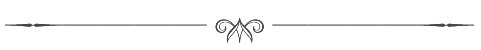
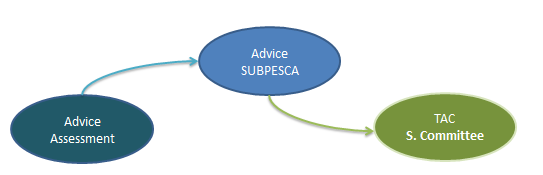
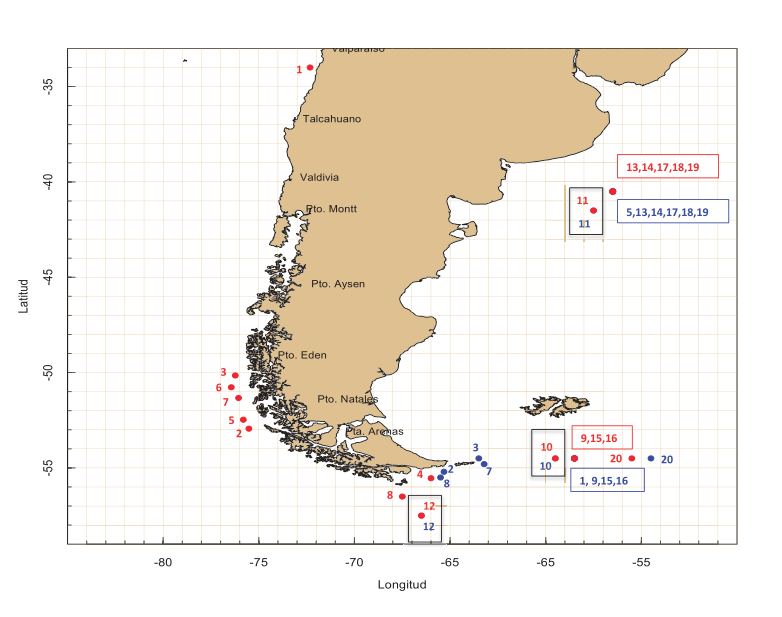
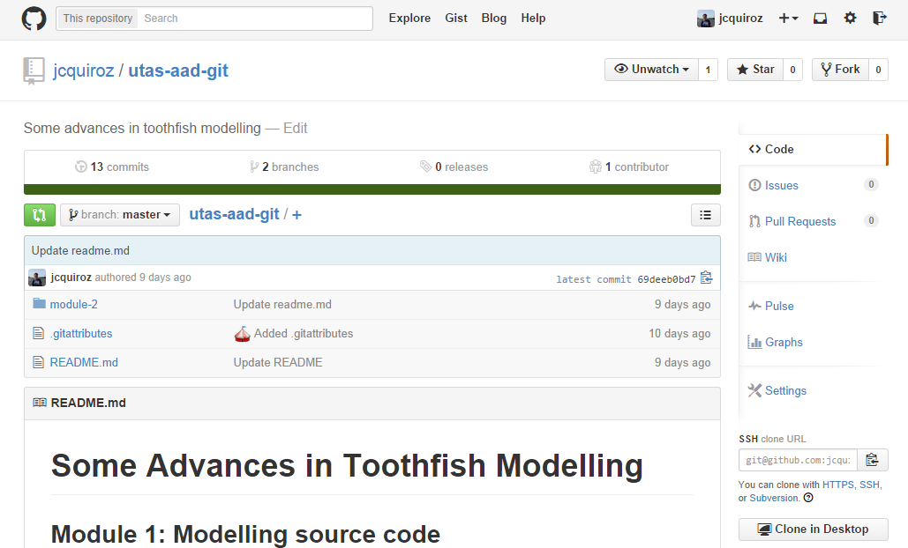

--- .quote .smaller


<div style="text-align:center">

</div>
&nbsp; 
>__Supervisors:__ &nbsp;
&nbsp;   
&nbsp; 
>  - Klaas Hartmann (IMAS)
>  - Caleb Gardner (IMAS)
>  - Dirk Welsford (AAD)
>  - Philippe Ziegler (AAD)
>  - Paul Burch (IMAS - AAD)


--- .segue .nobackground .dark

## Chapter 1

--- .middle  .smaller

<a class='example'>Chapter 1</a>

## Background

__Objetives__:
  * to review, discuss and expound the different TOP management process implemented worldwide
      - <span style="color:red; font-family:Georgia; font-size:1em;">Chapter 2</span>
  * to test the suitability of improve the actual modelling framework of TOP utilized in Kerguelen Plateau and South-America
      - <span style="color:red; font-family:Georgia; font-size:1em;">Chapter 3 & 4</span>
  * to develop a robust MSE approach of TOP consistent with the modelling improvements identified in Kerguelen Plateau and South-America
      - <span style="color:red; font-family:Georgia; font-size:1em;">Chapter 5</span>
  * to examine how the actual harvest policies implemented in Kerguelen Plateau and South-America influences the effectiveness of fishery management on TOP
      - <span style="color:red; font-family:Georgia; font-size:1em;">Chapter 5</span>
      

--- .segue .nobackground .dark

## Chapter 2

--- .middle .smaller

<a class='example'>Chapter 2</a>

## TOP fishery in South-America: Drawing lesson from others Toothfish fisheries
&nbsp;

> - Second major catch area worldwide
>     + <span style="color:green; font-family:Georgia; font-size:1em;">_Brief description of fishery_</span>
> - Management mechanism appears untransparent and inconsistent
>     + <span style="color:green; font-family:Georgia; font-size:1em;">e.g. _Time line of **TAC's** criteria_</span>
> - Recently changes in Fishery Act
>     + <span style="color:green; font-family:Georgia; font-size:1em;">e.g. _by-catch is 'legal'_</span>
> - Explicit management objectives established in 2013 (Chilean case)
>     + <span style="color:green; font-family:Georgia; font-size:1em;">e.g. _MSY-based Reference Points. Pathways?_</span>

--- .middle .smaller

<a class='example'>Chapter 2</a>

## Catches by area
&nbsp;

```{r echo = F, message = F, results = 'asis'}
require(rCharts)
myTF = read.csv('data2.csv')
n2 <- nPlot(C ~ year, group = 'FAO', type = 'stackedAreaChart', id = 'chart', data = myTF)
n2$chart(showControls = T)
n2$chart(useInteractiveGuideline=TRUE)
n2$print('chart2')
```

<span style="font-size:0.6em;">
Zone 87 & 41 ----> South America   
Zone 58 ----> Kerguelen Plateau   
Zone 48 ----> South Georgia   
</span>

--- .middle .smaller

<a class='example'>Chapter 2</a>

## TAC in Chile
&nbsp;


<div style="text-align:center">

</div>


--- &twocol w1:40% w2:60% .middle .smaller

<a class='example'>Chapter 2</a>

## Progress Chapter 2
&nbsp;   
&nbsp;   

*** =left

- __Documents__ (70% Chile - 30% Argentina)
  - Progress 85% (<a href="C:\Users\jcquiroz\Dropbox\CBA_bacalao">see ftp</a>)
- __Target Journal__
  - Marine Policy
  - Marine Resource Economics
  - CCAMLR Science (Paul's suggestion)
- __Milestone / First Draft__
  - January, 2015

*** =right

- __Contingencies__
  - Insufficient Bibliography
  - Possible survey to stakeholders
- __Possible requirements__
  - Include others people as co-authors 


--- .segue .nobackground .dark

## Chapter 3

--- .middle .smaller

<a class='example'>Chapter 3</a>

## Patagonian toothfish population dynamics in a spatially varying simulation framework: The case of Kerguelen Plateau
&nbsp;

In this Chapter I will try develop tools to improve the theoretical population dynamic of Patagonian Toothfish on Kerguelen Plateau, particularly related to demographic traits under a spatially-structured base   

&nbsp;

The research should use a __scenario-based__ analysis, avoiding parallel researches that come from FRDC project    

&nbsp;    

Most of the inputs to setting the different scenarios should be derived from FRDC project


--- .middle .smaller .fill

<a class='example'>Chapter 3</a>

<div style="text-align:center">

</div>


--- &twocol w1:40% w2:60% .middle .smaller

<a class='example'>Chapter 3</a>

## Progress Chapter 3
&nbsp;   
&nbsp;   

*** =left

- __Coding__ 
  - Progress 10% 
      - Some processes are finished (<a href="https://github.com/jcquiroz/Southern-Hake-Fishery/blob/master/model_2011/model_msur.tpl">repo</a>)
- __Target Journal__
  - Plos One (California corporation, USA)
- __Milestone / First Draft__
  - November, 2015

*** =right

- __Contingencies__
  - Largely depend on findings from __FRDC__ project
  - Overreaching in this Chapter <a href="comments_PB.pdf">see Paul's Comments</a>


--- .segue .nobackground .dark

## Chapter 4

---  &twocol w1:40% w2:60% .middle .smaller

<a class='example'>Chapter 4</a>

## Impact of misspecification model under a spatially-structured population, the TOP in South-America
A similar population dynamics


---  &twocol w1:40% w2:60% .middle .smaller

<a class='example'>Chapter 4</a>

## Impact of misspecification model under a spatially-structured population, the TOP in South-America
A similar population dynamics   
&nbsp;  

*** =left

__Chile (2012-2013)__
<div style="text-align:center">

</div>

*** =right

__Argentina (2004-2012)__
<div style="text-align:center">

</div>


---  &twocol w1:50% w2:50%  .middle .smaller 

<a class='example'>Chapter 4</a>

## Many issues remain

*** =left

&nbsp;   
&nbsp;  
&nbsp;   
&nbsp;
- Tag size-overlap
- Voluntary process (enforcement is necessary)
- Spatial and temporal sampling coverage
- Artesanal fleet participation

*** =right

&nbsp;   
&nbsp;   
<div style="text-align:center">

</div>


--- .segue .nobackground .dark

## Chapter 5

--- .middle .smaller

<a class='example'>Chapter 5</a>

## Bio-economic management strategy evaluation of TOP in  southern and antarctic oceans
&nbsp;
Still thinking about it !!, but a good start point maybe is Hoshino _et al._ (2010) ...   
&nbsp;  


--- .middle .smaller

<a class='example'>Chapter 5</a>

## Bio-economic management strategy evaluation of TOP in  southern and antarctic oceans
&nbsp;
Still thinking about it !!, but a good start point maybe is Hoshino _et al._ (2010) ...   
&nbsp;  

<div style="text-align:center">
   


</div>

--- .segue .nobackground .dark

## Support, coding and backup

--- .middle .smaller

<a class='example'>Support</a>

## Control version & Reproducible Research
&nbsp;
PhD Repository in __<a href="https://github.com/jcquiroz/utas-aad-git" target="_blank">GitHub</a>__

<div style="text-align:center">

</div>


--- .middle .smaller

<a class='example'>Support</a>

## LATEX based

Most of the writing outcomes will be based in Latex. Nevertheless Microsoft version files will also be stored. __Why use LATEX?__  <span style="color:red; font-family:Georgia; font-size:1em;">High typographical quality, time-saving, clean & order</span>.   
E.g.: <a href="thesis.pdf">Thesis Template</a> (Thanks to Paul for sharing his Thesis template)

<div style="text-align:center">

</div>


--- .segue .nobackground .dark

## Thank You!!!
